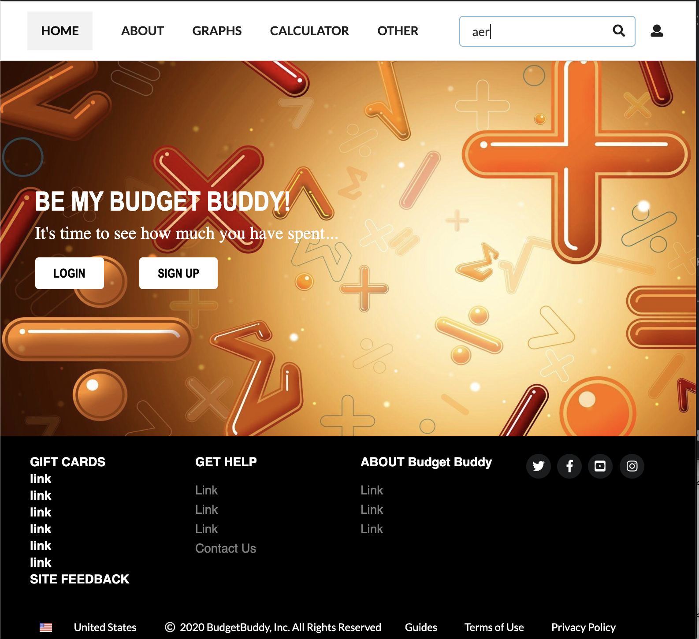
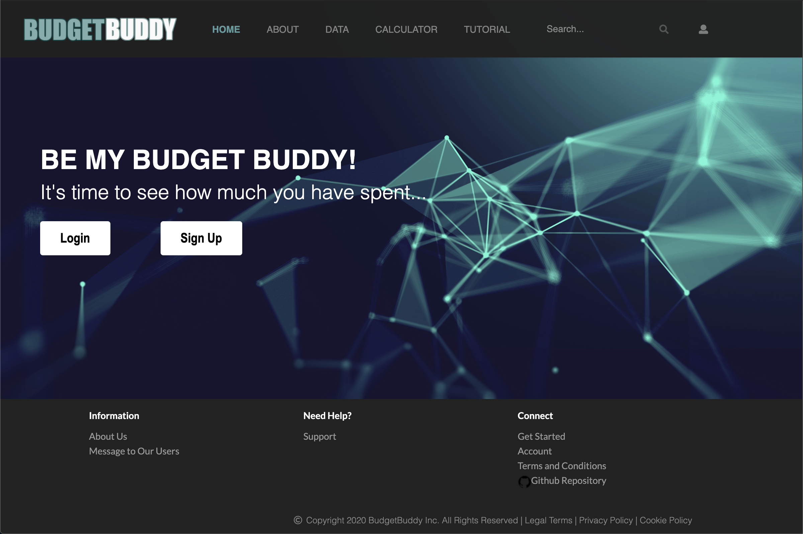
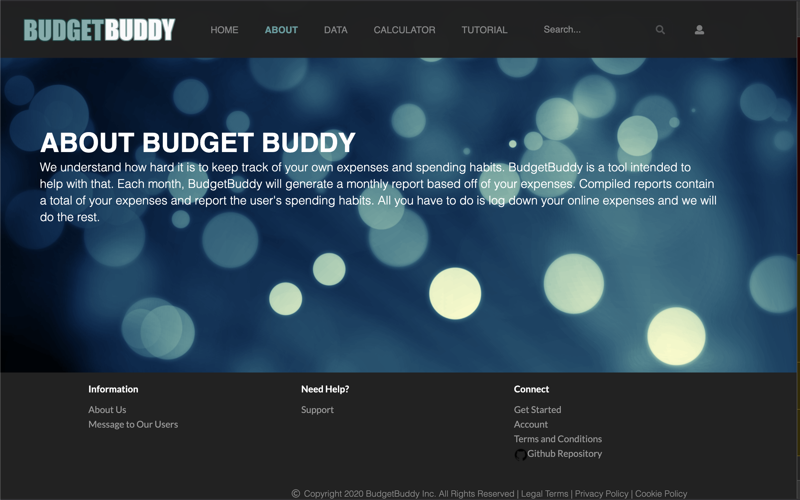

# BudgetBuddy
The BudgetBuddy web application will allow individuals to track their online purchases and find the total amount of money they spend in a month.

## Progress Completion
#### Whole Team
- Discussed with group and created an informational paper on what our project will be about.
- Created Github repository
- Began creating HTML files to start creating the base design of the web application

#### Completed By: Leah-Mei Villanueva

#### Initialization 
###### Date: (02/04/2020 - 02/24/2020)
- Created Github Repository
- Created initial setup for code (ESlint, html files)

######  Date: (02/25/2020 - 03/08/2020)
- Setup Semantic UI React 

#### Home Page
##### Date: (02/04/2020 - 02/24/2020)
- Created html mockup

##### Date: (02/25/2020 - 03/08/2020)
- Converted to react with new design

#### About Page
##### Date: (02/25/2020 - 03/08/2020)
- Converted to react with new design

#### Completed By: Sollie Garcia

#### Completed By: Levy Jean Matsuda

#### About Page
- About page mockup 

#### Completed By: Leisha Soberano-Keawemauhili
##### Date: (02/25/2020 - 03/15/2020)
#### Components
- Converted the TopMenu and FooterMenu into components for pages
#### App
- Implemented routing between pages through the navigation bar

## Pending Progress: 
#### Leah-Mei Villanueva
###### Date: (02/04/2020 - 02/23/2020)
- React setup for Sign up 
- React setup for Sign in 
- React setup for About page (completed 03/07/2020 LV)
- React setup for Home page (completed 03/07/2020 LV)

###### Date: (02/24/2020 - 03/08/2020)
#### Login Page
- Edit Sign in page/links and link to account (add error if no account)

#### Sign Up Page
- Edit sign up page/links and make it functional 

#### Other
- Specific route to different pages
- Route links to pages
- Run app as regular website

#### Levy Jean Matsuda
###### Date: (02/04/2020 - 02/23/2020)
- About page with React set-up (completed 03/07/2020 LV)

#### Sollie Garcia
###### Date: (02/04/2020 - 02/23/2020)
###### (02/24/2020 - 03/08/2020)

#### Leisha Soberano-Keawemauhili
###### Date: (02/04/2020 - 02/23/2020)
###### Date: (02/24/2020 - 03/15/2020)
- Implement routing
###### Date: (03/16/2020 - MM/DD/YYYY)

