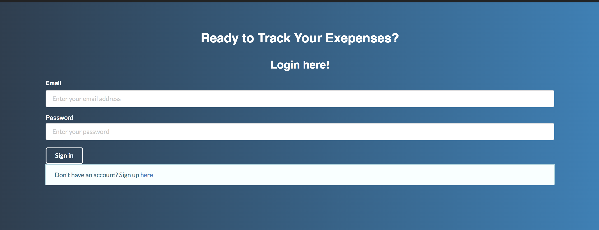
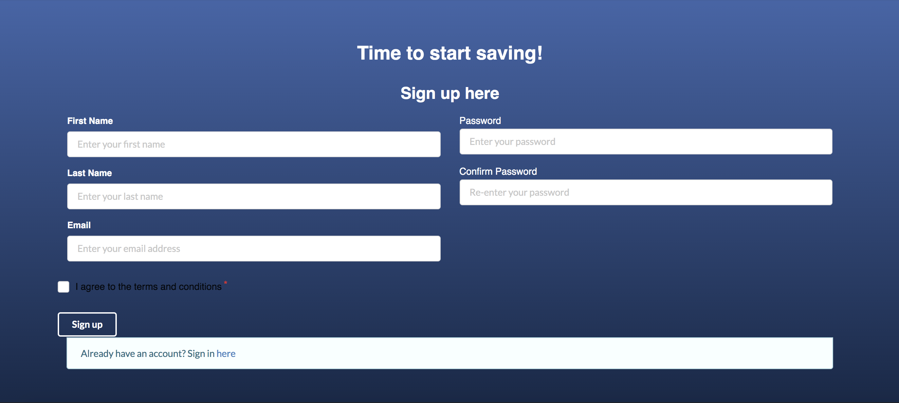

# Table of Contents

* [About BudgetBuddy](#about-budgetbuddy)
* [User Guide](#user-guide)
* [Development History](#development-history)
* [Developer Guide](#developer-guide)
  * [Installation](#installation)
  * [Github Workflow](#github-workflow)

# About BudgetBuddy


BudgetBuddy is a meteor application that....

# User Guide

### [Landing Page](http://budgetbuddy.meteorapp.com/#/)
#### The landing page when there is no user


From here the user can can log in, or choose to become a member.

##### The landing page greets the user, with a brief overview of what the application intends to accomplish.


# Development History

## Mockup Development

- Landing page
- User Home Page
- Admin Home Page

## Functional Implementation

## Beyond the Basics

# BudgetBuddy
The BudgetBuddy web application will allow individuals to track their online purchases and find the total amount of money they spend in a month.

## Progress Completion
#### Whole Team
- Discussed with group and created an informational paper on what our project will be about.
- Created Github repository
- Began creating HTML files to start creating the base design of the web application

#### Completed By: Leah-Mei Villanueva

#### Initialization
###### Date: (02/04/2020 - 02/24/2020)
- Created Github Repository
- Created initial setup for code (ESlint, html files)

######  Date: (02/25/2020 - 03/08/2020)
- Setup Semantic UI React

#### Home Page
##### Date: (02/04/2020 - 02/24/2020)
- Created html mockup


##### Date: (02/25/2020 - 03/08/2020)
- Converted to react with new design


#### About Page
##### Date: (02/25/2020 - 03/08/2020)
- Converted to react with new design


#### Completed By: Sollie Garcia

#### Completed By: Levy Jean Matsuda

#### About Page
- About page mockup


##### Date: (03/09/2020 - 04/12/2020)

### Sign-in Page
- created react design for sign in


### Registration page
- created react design for registration page


### Initialize Database and Backend Dependencies
- installed MongoDB, Express, Bycryptjs, jsonwebtoken, passport, validator, is-empty

### Build Server
- created server.js file to create and build express app
- configured databases
  - expense API
  - users API
- Created login and registration function
- Created functions to add, delete, and get expenses

### Fuzz Testing
- Tested register functions
- Tested login functions
- Tested expense functions (add, delete, get)


#### Completed By: Leisha Soberano-Keawemauhili
##### Date: (02/25/2020 - 03/15/2020)
#### Components
- Converted the TopMenu and FooterMenu into components for pages
#### App
- Implemented routing between pages through the navigation bar

###### Date: (04/13/2020 - 04/26/2020)
#### Expenses
- Created UI of add-budget.js for user to insert spending data
  - Implemented Date Picker for date selection
- Created UI expense.js as template for viewing spending data


## Pending Progress:
#### Leah-Mei Villanueva
###### Date: (02/04/2020 - 02/23/2020)
- React setup for Sign up (completed 04/02/2020 LM)
- React setup for Sign in (completed 04/02/2020 LM)
- React setup for About page (completed 03/07/2020 LV)
- React setup for Home page (completed 03/07/2020 LV)

###### Date: (02/24/2020 - 03/08/2020)
#### Login Page
- Edit Sign in page/links and link to account (add error if no account)

#### Sign Up Page
- Edit sign up page/links and make it functional

#### Other
- Specific route to different pages
- Route links to pages
- Run app as regular website

#### Levy Jean Matsuda
###### Date: (02/04/2020 - 02/23/2020)
- About page with React set-up (completed 03/07/2020 LV)

###### Date: (04/13/2020 - 04/26/2020)
### Configuration
- configure front-end and back-end connection
- Configure user with their logged expenses

### Client-end tasks
- Add mask to password input field
- React component for expense list
- Configure protected routes


#### Sollie Garcia
###### Date: (02/04/2020 - 02/23/2020)
###### (02/24/2020 - 03/08/2020)

#### Leisha Soberano-Keawemauhili
###### Date: (02/04/2020 - 02/23/2020)
###### Date: (02/24/2020 - 03/15/2020)
- Implement routing
- Convert/move HTML code from home and about files to component files for the navigation bar and footer menu
###### Date: (04/13/2020 - 04/26/2020)
- Front-end Expense input and viewing


# Developer Guide
### Want to join forces? Here's how!

#### Installation
First, [install meteor](https://www.meteor.com/install)

Second, [Fork us on github!](https://github.com/leahmeiv/BudgetBuddy) and clone the repo to your favorite laptop.

Once in the main directory simply...

```asp
cd app
```
After which you will need to install the required node libraries...
```asp
meteor npm intall
```
...as well as the following for the confirm box module...
```
npm install react-confirm-alert --save
```
```asp
npm install semantic-ui-react semantic-ui-css --save

```
The first time starting the app intializes some default data.  The output should look something like this...
```asp
meteor npm run start

> app@ start /Users/admin/github/budgetbuddy/budgetbuddy/app
> meteor run

[[[[[ ~/github/budgetbuddy/budgetbuddy/app ]]]]]    

=> Started proxy.                             
=> Started MongoDB.          
=> Started your app.
```

**That's it!**
You are now ready to start contributing to BudgetBuddy!

#### The color scheme used for BudgetBuddy is [Serio Verify](https://www.awwwards.com/sites/serio-verify)

-  `#17252a`
-  `#2b7a78`
-  `#3aafa9`
-  `#def2f1`
-  `#feffff`
