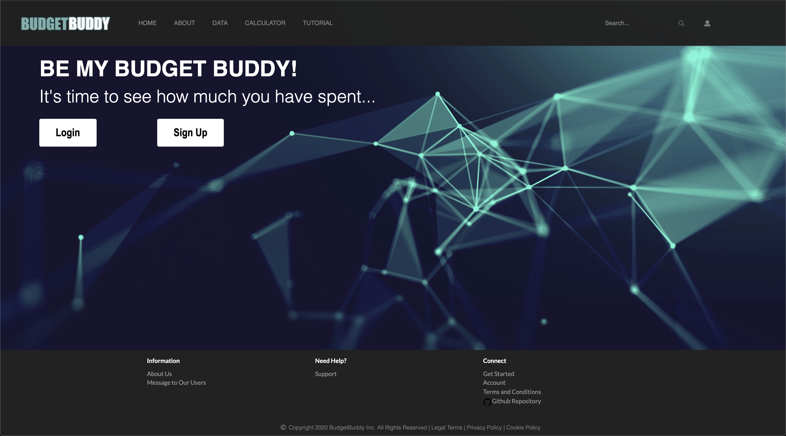
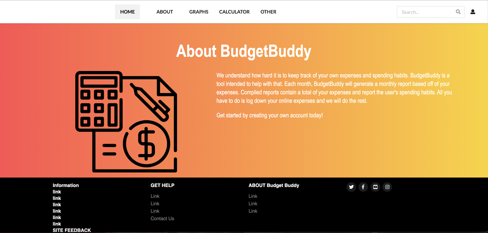

# BudgetBuddy
The BudgetBuddy web application will allow individuals to track their online purchases and find the total amount of money they spend in a month.

## Progress
- Discussed with group and created an informational paper on what our project will be about.
- Created Github repository
- Began creating HTML files to start creating the base design of the web application
- home.html mockup completed
-about.html mockup completed

## In-Progress
- React set up for Sign up, Sign in, About, and Home pages

## Team Efforts

###### Leah-Mei Villanueva

**Completed:**
- Created Github Repository
- Created initial setup for code (ESlint, html files)
- Home page mockup 

**Pending:**

###### Sollie Garcia

**Completed:**

**Pending:**

###### Levy Jean Matsuda

**Completed:**
- About page mockup 

**Pending:**
- About page with React set-up 

###### Leisha Soberano-Keawemauhili

**Completed:** 

**Pending:**

